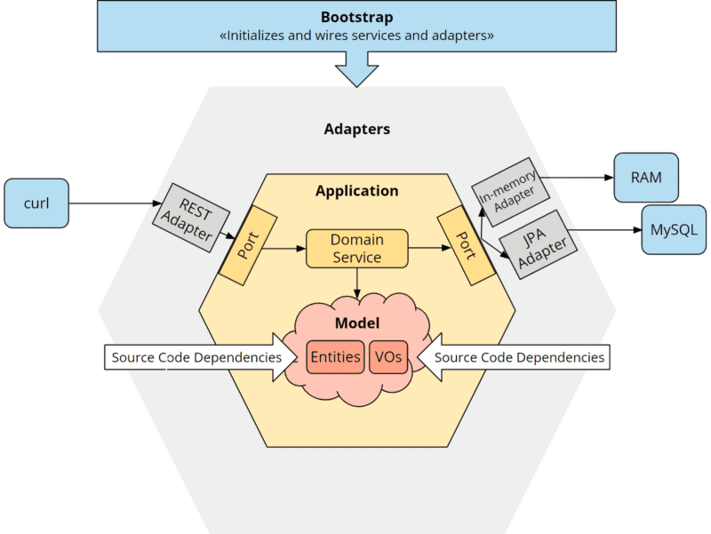
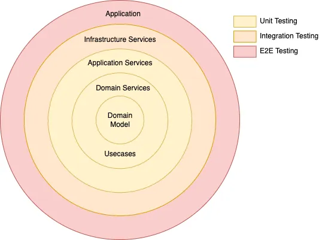

### What is Hexagonal Architecture?

Hexagonal architecture is a design pattern that aims to create loosely coupled, highly maintainable, and testable applications. The core idea is to place the business logic (the "core" of your application) at the center and isolate it from the outside world—like user interfaces, databases, or external services. This isolation happens through "ports" (interfaces defining what the core needs) and "adapters" (implementations that connect the core to the outside).

Think of it like a hexagon: the business logic sits in the middle, and each side of the hexagon represents a way the application interacts with the world (e.g., REST API, database, message queue). The beauty of this approach is that you can swap out how the app talks to the outside (e.g., switch from a SQL database to a NoSQL one) without touching the core logic.



###  Key Concepts
- #### Core (Domain): 
    The heart of your app—business rules and logic, free of any infrastructure concerns.

- #### Ports: 
    Interfaces that define how the core interacts with the outside world. There are two types:
    - Inbound Ports: Define how external systems (e.g., a REST controller) can trigger the core logic.
    - Outbound Ports: Define what the core needs from external systems (e.g., a repository interface to fetch data).
  
- #### Adapters: 
    Concrete implementations of the ports. For example:
    - Inbound Adapter: A REST controller calling the core via an inbound port.
    - Outbound Adapter: A JPA repository implementing an outbound port to talk to a database.


### **Services in hexagonal architecture:**

**Domain Services:**
- Encapsulate business logic that doesn’t belong to a single entity or value object.
- Operate purely within the domain layer, independent of external systems.
- Handle complex domain rules and business operations that involve multiple aggregates.

**Application Services:**
- Act as a bridge between the domain layer and external systems.
- Implements use cases defined in port.in/.
- Orchestrate use cases, invoking domain services and repositories.
- Uses port.out/ to interact with external systems like databases or messaging.

**Infrastructure Services:**
- Handle external communication (databases, messaging, APIs).
- Implement output ports defined in the application layer.
- Should be replaceable without affecting business logic.

### Package Structure
    
 #### Domain module package structure

```
com.jinternals.demo
│─── domain/
│    ├── model/
│    │    ├── Model1.java
│    │    ├── Model2.java
│    ├── service/
│    │    ├── DomainService1.java
```

#### Application module package structure

```
com.jinternals.demo
│─── application/
│    ├── port/
│    │    ├── in/
│    │    │    ├── UseCase1.java
│    │    ├── out/
│    │         ├── OrderOutputPort.java
│    ├── service/
│         ├── UserService.java
```

A Service in the Application Layer typically:


#### Application module package structure

```
com.jinternals.demo
│─── infrastructure/
│    ├── adapter/
│    │    ├── in/
│    │    │    ├── rest/
│    │    │    │    ├── SomeController.java
│    │    │    ├── event/
│    │    │         ├── KafkaListener.java
│    │    ├── out/
│    │         ├── persistence/
│    │         │    ├── SomeRepository.java
│    │         ├── messaging/
│    │              ├── SomeProducer.java
│    ├── config/
│         ├── ApplicationConfig.java
```


### What Are Micro Types (Value Objects)?
In Domain-Driven Design (DDD), micro types are typically value objects. These are small, immutable objects that represent specific concepts in your domain. Unlike primitive types 
(e.g., String or int), value objects add meaning, enforce rules, and improve type safety.

For example, instead of using a plain String for a product name or an int for a quantity in an order management system, you might create:

  #### OrderId: 
    A value object that ensures the order id isn’t empty.
```java
import static java.util.Objects.requireNonNull;

public record OrderId(String value) {
    public OrderId {
            requireNonNull(value , "OrderId cannot be null");
    }

    public static OrderId of(String value) {
        return new OrderId(value);
    }

    @Override
    public String toString() {
        return value;
    }
}
```
  #### Quantity: 
    A value object that ensures the quantity is positive.

```java
public record Quantity(BigDecimal value, Unit unit) {
  public Quantity {
    if ( value == null || value.compareTo(BigDecimal.ZERO) <= 0 ) {
      throw new IllegalArgumentException("Quantity must be positive");
    }
    if (unit == null) {
      throw new IllegalArgumentException("Unit cannot be null");
    }
  }
}
```
### Testing




### Other Links:
https://codebox.net/pages/microtypes-in-java